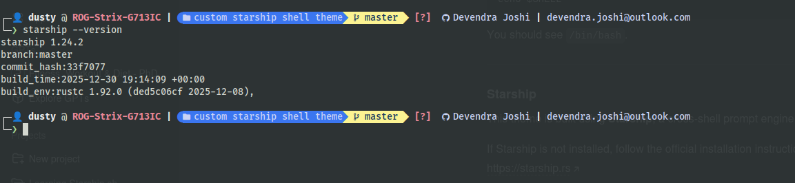

# DUSTY
A clean, opinionated Bash prompt theme built with Starship, designed for everyday terminal use and shared as a ready-to-use personal configuration.

## What the prompt looks like

Below is an example of how `dusty` appears in a Bash session.

> The screenshot uses FiraCode Nerd Font. Matching the font will give the closest visual result.



Cloning the repository is **not required** to use this theme.

---

## Why this exists

`dusty` started as my personal Bash prompt configuration.

After experimenting with Starship modules, layouts, and visual balance, I wanted a prompt that:

- Shows useful context without visual noise
- Stays readable during long terminal sessions
- Remains fast and predictable
- Reflects how I actually use the terminal day-to-day

This repository exists to share that setup with others — whether you want to use it as-is, learn from it, or adapt parts of it for your own workflow.


## Prompt structure

`dusty` uses a **multi-line layout**, typically structured as:

- **Line 1:** Identity and location  
  (user, host, directory, Git context)

- **Line 2:** Environment details  
  (shown only when relevant)

- **Line 3:** Prompt character  
  (where you type commands)

This layout improves readability and keeps focus on the command line itself.

---

## Git identity information

When you are inside a Git repository, it displays the **configured Git user name and email address** for that repository.

This is derived from Git’s effective configuration (repository-level or global) and helps:

- Make the active commit identity visible at a glance
- Reduce mistakes when working across multiple repositories
- Increase awareness of which identity is being used

This behavior is part of the default layout.

There is **no toggle or switch** to enable or disable this.  
Removing it requires editing the Starship configuration file and is intended for users comfortable modifying prompt configuration.

---

## Prerequisites

Before using `dusty`, make sure the following requirements are met.

### Bash
I wrote and tested it on **Bash** but, it should work with most other shells. 

Check your shell:
```bash
echo $SHELL
```

You should see `/bin/<your shell name>`.

---

### Starship

This theme is built using **Starship**, a cross-shell prompt engine.

Install Starship using the official instructions:
[https://starship.rs](https://starship.rs)

Verify installation:

```bash
starship --version
```

---

## Font requirement (important)

`dusty` was built and tested using **FiraCode Nerd Font**.

While other Nerd Fonts may work, this theme assumes glyphs and spacing as provided by FiraCode Nerd Font. Using a different font can result in misaligned symbols or missing icons.

### Recommended font

* **FiraCode Nerd Font**

This is the font used in the screenshot and during development.

---

## Installing FiraCode Nerd Font

### Linux (manual install)

```bash
mkdir -p ~/.local/share/fonts
cd ~/.local/share/fonts

wget https://github.com/ryanoasis/nerd-fonts/releases/latest/download/FiraCode.zip
unzip FiraCode.zip

fc-cache -fv
```

After installing the font:

1. Open your terminal preferences
2. Select **FiraCode Nerd Font**
3. Restart the terminal

---

## Quick start (recommended)

If you already have Starship installed, you only need the `starship.toml` file to use `dusty`.

### 1. Create the Starship configuration directory

```bash
mkdir -p ~/.config/starship
```

---

### 2. Download the configuration file

Place `starship.toml` in:

```text
~/.config/starship/starship.toml
```

---

### 3. Initialize Starship in Bash

Edit your Bash configuration:

```bash
nano ~/.bashrc
```

Add this line near the end:

```bash
eval "$(starship init bash)"
```

Reload Bash:

```bash
source ~/.bashrc
```

---

### 4. Open a new terminal

Your prompt should now appear as a **multi-line prompt** using the updated theme.

---

## Inspiration and background

The initial inspiration for this theme came from:

[https://www.adamdehaven.com/snippets/how-to-customize-your-shell-prompt-with-starship](https://www.adamdehaven.com/snippets/how-to-customize-your-shell-prompt-with-starship)

That guide provides a solid introduction to customizing shell prompts using Starship. However, its configuration relies on glyphs that no longer render reliably with newer Nerd Font releases.

Rather than pinning fonts or working around rendering issues, `dusty` adapts those ideas to work cleanly with modern Nerd Fonts, resulting in a customized and opinionated prompt configuration.

---


